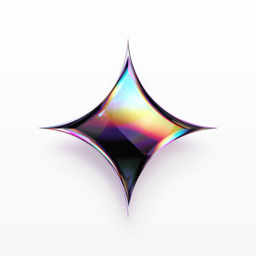
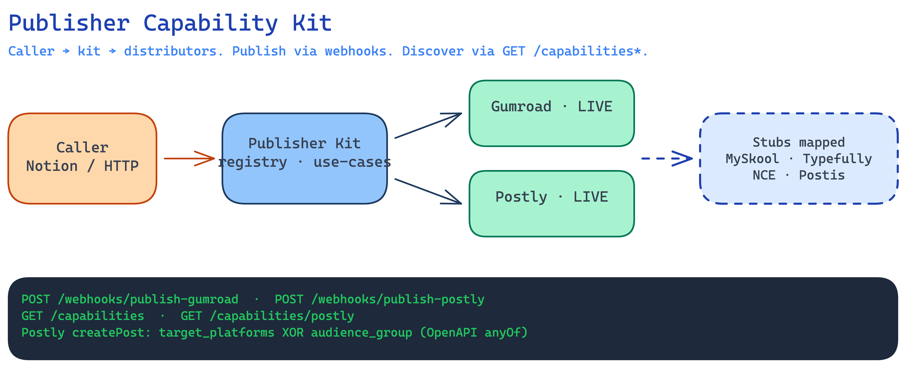

<div align="center">

```
            ╔════════════════════════════════════════════════════════════════════════╗
            ║                                                                        ║
            ║           ███╗   ██╗ ██████╗ ████████╗██╗ ██████╗ ███╗   ██╗           ║
            ║           ████╗  ██║██╔═══██╗╚══██╔══╝██║██╔═══██╗████╗  ██║           ║
            ║           ██╔██╗ ██║██║   ██║   ██║   ██║██║   ██║██╔██╗ ██║           ║
            ║           ██║╚██╗██║██║   ██║   ██║   ██║██║   ██║██║╚██╗██║           ║
            ║           ██║ ╚████║╚██████╔╝   ██║   ██║╚██████╔╝██║ ╚████║           ║
            ║           ╚═╝  ╚═══╝ ╚═════╝    ╚═╝   ╚═╝ ╚═════╝ ╚═╝  ╚═══╝           ║
            ║                                                                        ║
            ║  ██████╗ ██╗   ██╗██████╗ ██╗     ██╗███████╗██╗  ██╗███████╗██████╗   ║
            ║  ██╔══██╗██║   ██║██╔══██╗██║     ██║██╔════╝██║  ██║██╔════╝██╔══██╗  ║
            ║  ██████╔╝██║   ██║██████╔╝██║     ██║███████╗███████║█████╗  ██████╔╝  ║
            ║  ██╔═══╝ ██║   ██║██╔══██╗██║     ██║╚════██║██╔══██║██╔══╝  ██╔══██╗  ║
            ║  ██║     ╚██████╔╝██████╔╝███████╗██║███████║██║  ██║███████╗██║  ██║  ║
            ║  ╚═╝      ╚═════╝ ╚═════╝ ╚══════╝╚═╝╚══════╝╚═╝  ╚═╝╚══════╝╚═╝  ╚═╝  ║
            ║                                                                        ║
            ║                     notion-publisher · Nucleo Lab                      ║
            ╚════════════════════════════════════════════════════════════════════════╝
```

**Notion CMS orchestrator** — publish **events**, **products**, **social**, and **music/podcast** from Notion pages + automations.

[](./package.json)
[](./package.json)
[](https://www.notion.so/)
[](https://gumroad.com/)
[](https://postly.ai/)
[](#license)

<p>
  
  
  
  
  
  
  
  
  
  
</p>

Hosted at [`Nucleo-Lab/notion-publisher`](https://github.com/Nucleo-Lab/notion-publisher) *(private)*.  
Matrices · channels · discovery → **[CAPABILITIES.md](./CAPABILITIES.md)**

</div>

---

## Architecture



Source: [`docs/assets/publisher-capability-flow.excalidraw`](./docs/assets/publisher-capability-flow.excalidraw)

```text
Notion CMS  →  notion-publisher (this repo · no UI)
                    ├─ Events         → Luma (stub)
                    ├─ Products       → Gumroad (live) · GitHub (stub) · Skool/MySkool (discover)
                    ├─ Social         → Postly (live) · Typefully (stub) · Postiz (stub)
                    └─ Music/Podcast  → ONCE.app (stub)
```

Same **product** can ship to **Gumroad + GitHub + Skool** (Skool also adds community). Social stack: Postly = broad cloud; Typefully = cheaper text accounts (X / LinkedIn / Threads / Mastodon / Bluesky); Postiz = widest surface, prefer **self-hosted**.

**Live publish today:** Gumroad + Postly only.  
**Discover:** Skool via MySkool read API.  
Favicons: [`docs/assets/logos/`](./docs/assets/logos/).

---

## Status matrix

| | Name | Site | Layer | Status |
|---|---|---|---|---|
|  | **Notion** | [notion.so](https://www.notion.so/) | CMS | **live** |
|  | **Luma** | [luma.com](https://luma.com/) | Events | stub |
|  | **Gumroad** | [gumroad.com](https://gumroad.com/) | Products | **live** |
|  | **GitHub** | [github.com](https://github.com/) | Products | stub |
|   | **Skool (MySkool)** | [skool.com](https://www.skool.com/) · [myskool.xyz](https://myskool.xyz/) | Products + community | **discover** |
|  | **Postly** | [postly.ai](https://postly.ai/) | Social | **live** |
|  | **Typefully** | [typefully.com](https://typefully.com/) | Social | stub |
|  | **Postiz** | [postiz.com](https://postiz.com/) | Social | stub |
|  | **ONCE.app** | [beta.once.app](https://beta.once.app/) | Music / Podcast | stub |

---

## Notion DB setup — one database, views by source

**Target CMS contract:** one Notion database (`Publisher`) + views filtered by `Source Tags`. Production may still use separate Gumroad/Postly DBs today; unification is a follow-up (docs only this pass — no parser/webhook changes).

### One database

| | |
|---|---|
| Recommended name | `Publisher` |
| Control field | `Source Tags` (multi-select) |
| Tags | `Luma`, `Gumroad`, `GitHub`, `Skool`, `Postly`, `Typefully`, `Postiz`, `ONCE` |

### Recommended views

| View | Filter (`Source Tags` contains) | Purpose |
|---|---|---|
| All | — | Master board |
| Social — All | `Postly` **or** `Typefully` **or** `Postiz` | Shared social workbench |
| Social — Postly | `Postly` | Live social publish |
| Social — Typefully | `Typefully` | Text drafts / threads |
| Social — Postiz | `Postiz` | Self-hosted scheduler |
| Products — All | `Gumroad` **or** `GitHub` **or** `Skool` | Same product, multi-target |
| Products — Gumroad | `Gumroad` | Live storefront |
| Products — GitHub | `GitHub` | Releases (planned) |
| Products — Skool | `Skool` | Community / product (discover → write) |
| Events — Luma | `Luma` | Events |
| Music — ONCE | `ONCE` | DSP |

### Shared properties (all views)

| Property | Type | Role |
|---|---|---|
| `Name` | Title | Row identity |
| `Source Tags` | Multi-select | Which distributors receive the row |
| `Caption` | Rich text | Shared caption / description (social + fallback) |
| `Video` | Files & media | Shared video |
| `Image` / `Screenshot` | Files & media | Shared still |
| `GIF` | Files & media | Shared animated |
| `Audio` | Files & media | Podcast / music (ONCE) |
| `File` / `Template` | Files & media **or** rich text | Product payload (Gumroad / GitHub) |
| `Topics` | Multi-select | Content taxonomy (not a distributor) |
| `Status` | Status | Aggregate publish state |

**Alias (live Postly today):** parser still reads `POV Text`. Treat `Caption` as the canonical shared name; `POV Text` remains accepted until a code migration.

### Social — shared media + optional channel overrides

One `Caption` / `Video` / `Image` / `GIF` set for Social — All / Postly / Postiz / Typefully. Fill a channel override only when copy must differ; empty override → fall back to `Caption`.

| Property | Type | Role |
|---|---|---|
| `Instagram Caption` | Rich text | Instagram override |
| `Facebook Post` | Rich text | Facebook override |
| `LinkedIn Post` | Rich text | LinkedIn override |
| `TikTok Caption` | Rich text | TikTok override |
| `Twitter Post` / `X Post` | Rich text | X / Threads-related override |
| `YouTube Title` / `YouTube Caption` | Rich text | YouTube |
| `Pinterest Title` / `Pinterest Description` | Rich text | Pinterest |
| `Universal First Comment` | Rich text | First comment when supported |
| `Typefully Thread` / `Typefully Account` | Rich text / select | Typefully-only |
| `Postiz Targets` | Multi-select | Postiz destinations |
| `Postiz {Channel}` | Rich text | Postiz-only extras (Discord, Slack, …) |

Live Postly property names stay case-sensitive as listed under Postly below. Stubs reuse the same shared + override model.

### Multimedia support

| Kind | Typical property | Used by |
|---|---|---|
| Video | `Video` | Postly, Postiz, Skool, Luma cover/reel |
| Image | `Image` / `Screenshot` / covers | All layers |
| GIF | `GIF` | Postly / Postiz |
| Audio | `Audio` | ONCE (music / podcast) |
| Document / JSON | `Template` / `File` | Gumroad, GitHub Releases |

Per-source product/event/music fields stay under each distributor section below.

---

##  Luma (stub, events)

Workshops, launches, calendar. **Mapped only.** Env: `LUMA_API_KEY`.

**Channels:** Luma event page (single surface).

#### Suggested Notion fields

| Property | Type | Role |
|---|---|---|
| `Luma Title` | Rich text | Event title (or reuse `Name`) |
| `Luma Start` | Date | Start datetime |
| `Luma End` | Date | End datetime |
| `Luma Location` | Rich text | Place or `Online` |
| `Luma Description` | Rich text | Event body (or reuse `Body`) |
| `Luma Cover` | Files & media | Hero image (or shared `Image`) |
| `Luma Event URL` | URL | Output when wired |
| `Luma Publish Status` | Status | Output when wired |

Tag row with `Source Tags` → `Luma`.

---

## Products layer

One digital product → optionally **Gumroad + GitHub + Skool**. Set `Source Tags` accordingly.

###  Gumroad (live)

Digital storefront for GPT-Chain JSON (and similar) files.

**Channels:** Gumroad product listing / storefront.

**What we implement:** create draft · multipart file/cover upload · publish / unpublish · daily autopilot.

#### Notion property contract (case-sensitive, live)

**Inputs (you fill):**

| Property | Type | Role |
|---|---|---|
| `Gumroad Title` | Rich text | Product title (fallback: `Prompt Chain Template Name`) |
| `Landing Page Copy` | Rich text | Store description (markdown → HTML in pipeline) |
| `Template` | Rich text | **Required for live publish.** Valid JSON; Notion may fragment long values — service reassembles |
| `Gumroad Cover` | Files & media | Promotional cover |
| `Gumroad Thumbnail` | Files & media | Square feed thumbnail |

**Outputs (bot fills):**

| Property | Type | Role |
|---|---|---|
| `Gumroad Publish Status` | Status | `Not started` / `Unpublished` / `Published` / `Failed` |
| `Gumroad Product ID` | Rich text | Internal id (needed to unpublish) |
| `Gumroad URL` | URL | Public short link |
| `Gumroad Edit URL` | URL | Gumroad admin edit link |

**Daily flow:** fill title / landing / cover / thumbnail + paste JSON into `Template` → Notion automation → `POST /webhooks/publish-gumroad` → status + URLs sync back.

**Draft safety:** missing/invalid `Template` → Gumroad **draft** only; Notion `Unpublished`.

**Unpublish:** `POST /webhooks/unpublish-gumroad`. **Autopilot:** `GUMROAD_AUTOPILOT_ENABLED=true`.

---

###  GitHub (stub, products)

Ship the same product as a **GitHub Release** (assets + notes). Env: `GITHUB_TOKEN`.

**Channels:** GitHub Releases (downloadable assets).

#### Notion property contract (**planned**)

| Property | Type | Role |
|---|---|---|
| `GitHub Repo` | Rich text / URL | `owner/repo` or repo URL |
| `Release Tag` | Rich text | e.g. `v1.2.0` |
| `Release Notes` | Rich text | Release body (markdown) |
| `Template` | Rich text | Same product JSON/file source as Gumroad |
| `GitHub Asset` | Files & media | Optional override file for the release asset |
| `GitHub Publish Status` | Status | Output |
| `GitHub Release URL` | URL | Output |
| `GitHub Release ID` | Rich text | Output |

---

###   Skool / MySkool (discover)

**Channels:** Skool **groups/communities** attached to the MySkool API key (product drop + community post).

Docs: https://myskool.xyz/docs · API: `https://api.myskool.xyz/v1` · Auth: `Bearer sk_live_…`

**Implemented (read):** groups / posts / comments → `GET /capabilities/skool`.  
**Planned upstream:** `POST /v1/posts` (Phase 2).

#### Notion property contract (**planned** for write)

| Property | Type | Role |
|---|---|---|
| `Skool Group ID` | Rich text | Target group (`gid`) — or env `SKOOL_GROUP_ID` |
| `Skool Title` | Rich text | Post title |
| `Skool Body` | Rich text | Post body / markdown |
| `Skool Media` | Files & media | Optional (or shared `Video` / `Image`) |
| `Skool Publish Status` | Status | Output when write ships |
| `Skool Post URL` | URL | Output when write ships |

```bash
curl -s localhost:3000/capabilities/skool | jq .
```

---

## Social layer

###  Postly (live)

Broad multi-platform cloud. OpenAPI: https://docs.postly.ai/openapi.yaml

#### Channels (catalog)

| Family | Channels |
|---|---|
| Social | Instagram, Facebook, LinkedIn, X, Threads, TikTok, YouTube, Pinterest, Bluesky, Google Business Profile |
| Messaging | Telegram, WhatsApp |
| Blog | WordPress, Ghost, Hashnode, Dev.to, Blogger |
| Email | Email (+ providers) |
| Docs-only | Reddit |

Live targets: `POSTLY_TARGET_PLATFORMS` (`identifier:id`). `POSTLY_AUDIENCE_GROUP` unused by default publish.

#### Notion property contract (case-sensitive, live)

Uses the **shared Social model** above. Live parser keys today:

| Property | Type | Role |
|---|---|---|
| `POV Text` | Rich text | Shared caption alias (canonical docs name: `Caption`) |
| `Instagram Caption` | Rich text | Instagram override |
| `Facebook Post` | Rich text | Facebook override |
| `LinkedIn Post` | Rich text | LinkedIn override |
| `TikTok Caption` | Rich text | TikTok override |
| `Twitter Post` | Rich text | Threads (and related) override |
| `Pinterest Title` | Rich text | Pinterest title |
| `Pinterest Description` | Rich text | Pinterest description |
| `YouTube Title` | Rich text | YouTube title |
| `YouTube Caption` | Rich text | YouTube description |
| `Universal First Comment` | Rich text | First-comment when supported |
| `Video` / `GIF` / `Screenshot` | Files & media | Media (priority: Video → GIF → Screenshot) |

**Optional future overrides (catalog-ready, not required today):** `X Post`, `Bluesky Post`, `Telegram Post`, `WhatsApp Post`.

**Outputs:** `Status`, `Instagram Status`, `Instagram URL`, `Post ID`, `Postly Error`.

**Targeting:** `?target=0` / `?target=0,2`. **Polling:** backoff `[30s, 10s, 20s, 30s, 40s, 50s, 60s]`. **Queue:** `POSTLY_QUEUE_ENABLED=true`.

---

###  Typefully (stub)

Cheaper **text-first** path with strong per-account granularity. Env: `TYPEFULLY_API_KEY`.

#### Channels

| Channel | Suggested override (empty → `Caption`) |
|---|---|
| X (Twitter) | `X Post` / `Twitter Post` |
| LinkedIn | `LinkedIn Post` |
| Threads | `Twitter Post` (or Threads-specific later) |
| Mastodon | `Typefully Mastodon` (optional) |
| Bluesky | `Typefully Bluesky` (optional) |

#### Suggested Notion fields

| Property | Type | Role |
|---|---|---|
| `Caption` | Rich text | Shared draft (same as Social) |
| `Typefully Thread` | Rich text | Multi-tweet / thread continuation |
| `Typefully Account` | Rich text / select | Which connected account |
| `Typefully Publish Status` | Status | Output |
| `Typefully URL` | URL | Output |

Media: usually text-only; optional shared `Image` when the channel supports it. Tag `Source Tags` → `Typefully`.

---

###  Postiz (stub)

Widest scheduler surface (open-source). Prefer **self-hosted** over expensive cloud. Env: `POSTIZ_API_KEY`.

Provider list from official [`postiz-app` social integrations](https://github.com/gitroomhq/postiz-app/tree/main/libraries/nestjs-libraries/src/integrations/social).

#### Channels by family → suggested Notion overrides

Global: shared `Caption` + `Postiz Targets` (multi-select) + shared `Video` / `Image` / `GIF`. Empty channel override → `Caption`.

| Family | Channels | Suggested overrides |
|---|---|---|
| Social | X, Instagram (+ standalone), Facebook, LinkedIn (+ Page), TikTok, YouTube, Threads, Pinterest, Reddit, Bluesky, Mastodon (+ custom), Tumblr, VK, MeWe | `Postiz X`, `Postiz Instagram`, `Postiz Facebook`, `Postiz LinkedIn`, `Postiz TikTok`, `Postiz YouTube`, `Postiz Threads`, `Postiz Pinterest`, `Postiz Reddit`, `Postiz Bluesky`, `Postiz Mastodon`, `Postiz Tumblr`, `Postiz VK`, `Postiz MeWe` |
| Communities / forums | Lemmy, Skool, Whop, Farcaster, Nostr | `Postiz Lemmy`, `Postiz Skool`, `Postiz Whop`, `Postiz Farcaster`, `Postiz Nostr` |
| Messaging | Telegram, Discord, Slack | `Postiz Telegram`, `Postiz Discord`, `Postiz Slack` |
| Live / creator | Twitch, Kick | `Postiz Twitch`, `Postiz Kick` |
| Design | Dribbble | `Postiz Dribbble` |
| Blog / newsletters | Medium, Dev.to, Hashnode, WordPress, Listmonk | `Postiz Medium`, `Postiz Devto`, `Postiz Hashnode`, `Postiz WordPress`, `Postiz Listmonk` |
| Local | Google Business (GMB) | `Postiz Google` |

| Property | Type | Role |
|---|---|---|
| `Caption` | Rich text | Shared default (same Social model) |
| `Postiz Targets` | Multi-select | Subset of channels above |
| `Postiz Publish Status` | Status | Output |
| `Postiz URLs` | Rich text / URL | Output (per-channel lines) |

Tag `Source Tags` → `Postiz`. Full matrix also in [CAPABILITIES.md](./CAPABILITIES.md).

---

##  ONCE.app (stub, music / podcast)

Music DSP distribution via [ONCE.app](https://once.app/) / [beta.once.app](https://beta.once.app/). Env: `ONCE_API_KEY`.

#### DSP destinations (documented)

| DSP | Notes |
|---|---|
| Spotify | Major streaming |
| Apple Music | Major streaming |
| YouTube Music | Major streaming |
| Amazon Music | Major streaming |
| Tidal | Hi-fi / streaming |
| Deezer | Streaming |
| Pandora | Streaming (US-focused) |
| Other DSPs | Via ONCE network (do not assume a fixed extra list in Notion) |

#### Suggested Notion fields

| Property | Type | Role |
|---|---|---|
| `ONCE Title` | Rich text | Track / episode title (or `Name`) |
| `ONCE Audio` | Files & media | Master audio (or shared `Audio`) |
| `ONCE Artwork` | Files & media | Cover art (or shared `Image`) |
| `ONCE Metadata` | Rich text | JSON or credits / ISRC notes |
| `ONCE Targets` | Multi-select | Spotify, Apple Music, YouTube Music, Amazon Music, Tidal, Deezer, Pandora |
| `ONCE Publish Status` | Status | Output |
| `ONCE URL` | URL | Output |

Tag `Source Tags` → `ONCE`.

---

## HTTP surface

| Method | Path | Role |
|---|---|---|
| `POST` | `/webhooks/publish-gumroad` | Create / publish product |
| `POST` | `/webhooks/unpublish-gumroad` | Unpublish product |
| `POST` | `/webhooks/publish-postly` | Social publish (`?target=` optional) |
| `GET` | `/capabilities` | Registry + layers + Postly catalog |
| `GET` | `/capabilities/postly` | Live socials + audience groups |
| `GET` | `/capabilities/skool` | MySkool discover (or stub message if no key) |

---

## Quick start

```bash
npm install
cp .env.example .env   # NOTION_TOKEN, GUMROAD_TOKEN, POSTLY_*
npm run build
npm run dev            # http://localhost:3000
npm run capabilities:check
```

```bash
ngrok http 3000
#   https://<ngrok>/webhooks/publish-gumroad
#   https://<ngrok>/webhooks/unpublish-gumroad
#   https://<ngrok>/webhooks/publish-postly
```

### Environment (minimal)

```env
NOTION_TOKEN=
GUMROAD_TOKEN=
POSTLY_API_KEY=
POSTLY_WORKSPACE_ID=
POSTLY_TARGET_PLATFORMS=instagram:id,facebook:id

SKOOL_API_KEY=sk_live_xxxxxxxxxxxx
SKOOL_GROUP_ID=

GITHUB_TOKEN=
TYPEFULLY_API_KEY=
POSTIZ_API_KEY=
ONCE_API_KEY=
LUMA_API_KEY=
```

Full knobs: [`.env.example`](./.env.example). Matrices: [CAPABILITIES.md](./CAPABILITIES.md).

### Scripts

```bash
npm run build && npm run dev
npm run capabilities:check
npm run publisher:report
```

---

## Roadmap

1. Skool read / discover ← current
2. Skool write when MySkool `POST /v1/posts` ships
3. GitHub Releases product publish
4. Typefully / Postiz (self-hosted) / ONCE / Luma clients
5. Optional Postly `audience_group` on the live publish path

---

## Contributing

Internal Nucleo Lab / Nebulabs tooling. Prefer tiny diffs; update [`CAPABILITIES.md`](./CAPABILITIES.md) when adding a distributor. Do not invent publish webhooks for stub/discover connectors.

## License

Private repository. All rights reserved unless a `LICENSE` file is added later.
